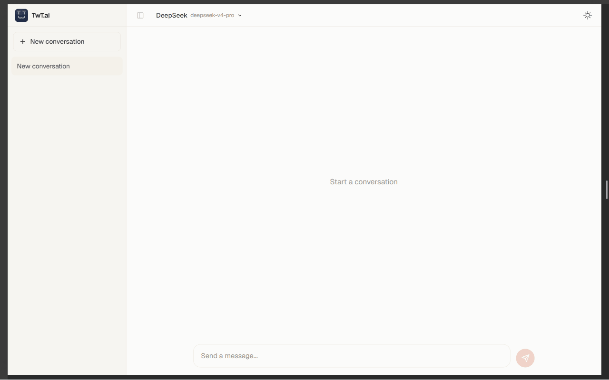

# TwT.ai

受 claude.ai 启发的多模型 AI 聊天前端。支持 Claude、DeepSeek、ModelScope 和自定义供应商切换，具备持久化对话历史、流式响应、按模型参数设置，以及内嵌交互式 HTML/React/SVG 视图的 Artifact 系统。

[English](README.en.md)



## 特性

- **多模型** — Claude、DeepSeek、ModelScope，以及自定义 OpenAI 兼容供应商
- **流式响应** — 基于 SSE 的实时渲染，RAF 节流更新
- **Artifact 系统** — 模型生成的 React / HTML / SVG 在沙箱化 iframe 中渲染
- **结构化输入** — `<ask_user>` 选项卡式问题卡片，引导用户逐步提供信息
- **双主题** — 暖白画布浅色 + 午夜深色，偏好持久化到 localStorage
- **对话历史** — IndexedDB 持久化，侧边栏导航，自动裁剪（50 会话 / 200 消息）
- **按模型设置** — Temperature、Max tokens、System prompt 每个供应商独立配置（会话内调试，重启读取 .env 默认值）
- **复制 / 编辑 / 重试** — 用户消息气泡上的操作按钮
- **调试模式** — `NEXT_PUBLIC_DEBUG` 开关，统一日志 + 实时调试面板

## 快速开始

**环境依赖：** Node.js >= 20，pnpm >= 9

```bash
# 克隆
git clone https://github.com/Yi-07/TwT.ai.git
cd TwT.ai

# 安装
pnpm install

# 配置
cp .env.example .env.local
# 编辑 .env.local 填入你的 API 密钥

# 启动
pnpm dev
```

打开 [http://localhost:3000](http://localhost:3000)。

## 配置

### 内置供应商

| 供应商 | 环境变量 |
|--------|----------|
| Claude | `ANTHROPIC_API_KEY`、`CLAUDE_MODEL`、`CLAUDE_BASE_URL` |
| DeepSeek | `DEEPSEEK_API_KEY`、`DEEPSEEK_MODEL` |
| ModelScope | `DASHSCOPE_API_KEY`、`MODELSCOPE_MODEL` |

### 自定义供应商

在 `CUSTOM_PROVIDERS` 环境变量中填写 OpenAI 兼容接口的 JSON 数组：

```bash
CUSTOM_PROVIDERS=[{"id":"groq","name":"Groq","type":"openai-compatible","apiKey":"gsk_xxx","baseUrl":"https://api.groq.com/openai/v1","model":"llama3-70b-8192"}]
```

重启 `pnpm dev` 即可生效，无需修改代码。

### 模型默认值

```bash
NEXT_PUBLIC_DEFAULT_PROVIDER=deepseek      # 首次加载时的默认供应商
NEXT_PUBLIC_DEFAULT_TEMPERATURE=1          # API 和 Settings 面板共用
NEXT_PUBLIC_DEFAULT_MAX_TOKENS=131072      # API 和 Settings 面板共用
```

### 服务端持久化与生产环境锁定

参见 [部署](#部署) 章节的 PostgreSQL 配置和生产环境设置。

## 技术栈

| 层级 | 技术 |
|------|------|
| 框架 | Next.js 15 (App Router) |
| 语言 | TypeScript (strict) |
| 样式 | Tailwind CSS v4 |
| 状态管理 | Zustand v5 + IndexedDB 持久化 |
| Markdown | react-markdown + remark-gfm |
| 包管理器 | pnpm |

## 架构

```
POST /api/chat → Provider Registry → Claude / DeepSeek / ModelScope
                                   → ReadableStream (SSE)
                                   → useStream hook (RAF 节流)
                                   → MessageBubble (Markdown + Artifacts)
```

- **`lib/providers/`** — 模型适配器。`config.ts` 集中管理所有供应商定义。`index.ts`（仅服务端）按类型创建实例。`registry.ts`（客户端安全）导出元数据。
- **`lib/store/`** — Zustand 状态库：`conversation.ts`（IndexedDB）、`model.ts`（localStorage）。
- **`components/`** — 聊天界面、侧边栏、模型控件、主题切换、调试面板、Artifact 沙箱。
- **`lib/utils/`** — Artifact 解析器（状态机）、`<ask_user>` 解析器、日志工具。

详细架构文档和贡献指南见 [CLAUDE.md](CLAUDE.md)。

## 命令

| 命令 | 说明 |
|------|------|
| `pnpm dev` | 启动开发服务器 |
| `pnpm build` | 生产构建 |
| `pnpm tsc --noEmit` | 类型检查 |
| `pnpm lint` | ESLint 检查 |

## 部署

### Vercel（推荐）

1. 推送代码到 GitHub
2. 打开 [vercel.com](https://vercel.com) → New Project → 导入你的仓库
3. 在 **Environment Variables** 中添加 API 密钥和 [.env.example](.env.example) 中的配置
4. 部署 — Vercel 自动识别 Next.js

### 服务端持久化（可选）

需要跨设备同步对话时，启用 PostgreSQL 存储：

1. 在 [Neon](https://neon.tech) 创建免费数据库并执行建表：

```sql
CREATE TABLE IF NOT EXISTS state (
  key TEXT PRIMARY KEY,
  value JSONB NOT NULL,
  updated_at TIMESTAMPTZ DEFAULT NOW()
);
```

2. 在 Vercel 中添加环境变量：

```
NEXT_PUBLIC_STORAGE_MODE=server
ACCESS_SECRET=<随机字符串>
NEXT_PUBLIC_ACCESS_SECRET=<与上相同>
DATABASE_URL=postgres://...
```

3. 重新部署。对话数据现在持久化到 PostgreSQL。

### 生产环境锁定

```bash
ACCESS_PASSWORD=你的密码               # 可选：设置后首次访问需要输入密码
NEXT_PUBLIC_DEBUG=false                # 确保调试工具关闭（含 Settings 面板）
```

## 沙箱依赖（本地托管）

Artifact 沙箱依赖托管在 `public/vendor/`，运行时无外部 CDN 请求：

| 文件 | 来源 | 版本 |
|------|------|------|
| `react.umd.js` | cdnjs / React | 18.3.1 |
| `react-dom.umd.js` | cdnjs / ReactDOM | 18.3.1 |
| `babel.min.js` | cdnjs / Babel Standalone | 7.28.4 |
| `recharts.umd.js` | unpkg / Recharts | 2.15.3 |
| `lodash.umd.js` | unpkg / lodash | 4.17.21 |
| `prop-types.umd.js` | cdnjs / prop-types | — |

## 许可证

MIT
